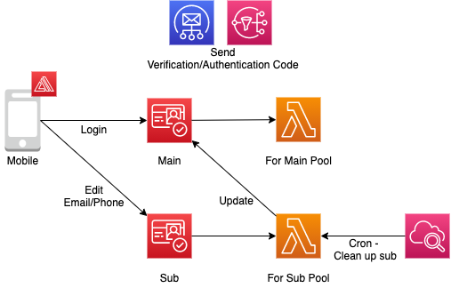

# CognitoMfaSample
CognitoのユーザプールをReact Nativeから叩いて遊んでみるリポジトリ（TOTPによるMFAに対応予定）

## アーキテクチャ


### 特記事項
- メールアドレス、電話番号の更新時には、サブのユーザプールを使用します。理由についてはこちらのPRを参照ください。
- サブのユーザプールは、1ユーザの有効時間が24時間であれば良く、費用抑制のために、CloudWatch Eventで1日1回のクリーンアップ処理を実施します。


## 機能
- サインアップ
  - [x] 検証コードの送信先にメールアドレスを指定したサインアップ
    - [x] 検証コードの再送
  - [x] 日本の電話番号が登録可能
- サインイン
  - [x] username、パスワードによるサインイン
  - [x] username、パスワード、およびSMSを使用したMFAによるサインイン
    - [ ] MFAコードの再送
- サインアウト
  - [x] ローカルのサインアウト
- 属性確認
  - [ ] 属性のkey-valueを表示
- パスワード忘れ
  - [x] 登録しているメールアドレスへの送信および変更処理
- パスワード更新
  - [ ] 新旧パスワード入力による変更
- 属性更新
  - [x] メールアドレス
  - [ ] 電話番号

### Backlog
- [ ] グローバルサインアウト


## セットアップ
このリポジトリは、expoのbare workflowに従って作成されています。
詳しくは[こちら](https://reactnative.dev/docs/environment-setup)を参照してください。

## デバッグ
### 下準備
環境変数の設定を行ってください。  
※ 環境変数の読み取りには、[react-native-config](https://www.npmjs.com/package/react-native-config)を使用しています。
```
cp .env.sample .env
```

設定する項目は`.env.sanple`を参照ください。

### iOSシミュレータでのデバッグ
```
npm run ios
```

機種を指定したい場合(iPhone Xの場合)
```
npm run ios -- --simulator="iPhone X"
```

### Androidエミュレータでのデバッグ
```
npm run android
```

## トラブルシューティング
### Windows環境で起動に失敗する
`ANDROID_HOME`に加え、`ANDROID_SDK_ROOT`を登録してください。

```
ANDROID_SDK_ROOT=%ANDROID_HOME%
```